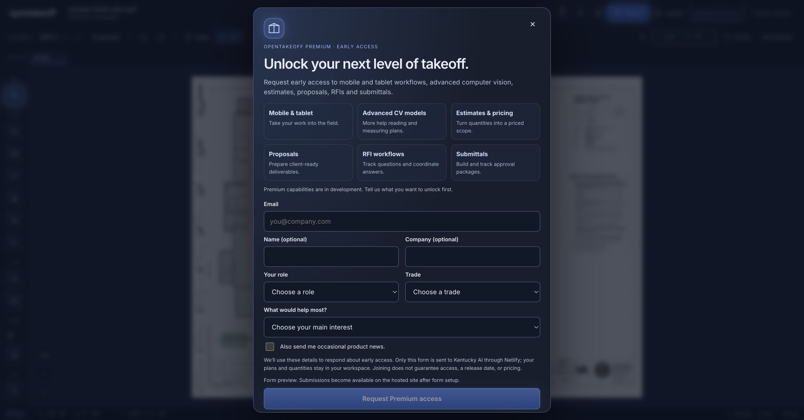

# Premium workspace branch review

## Scope

Premium workspace (also reachable with `?workspace=premium`) builds on the existing Workspace preview: graphite, light and HUD surfaces; personal backlight/readout settings; panel controls beside Quantities that move to the right in Focus mode; larger gallery cards and a separate detailed sheet preview. Existing measuring, review and material handlers remain in use.

Create annotation stays in the drawing toolbar. Markup list opens existing annotations and uses a document icon. Draft remains beside Snap and 45°. The project quantity counter and floating readout are independent preferences.

## Current evidence — 2026-09-15


Screenshots use the bundled public sample plan. Earlier workspace verification documents describe earlier iterations; they are not proof of every change on this branch.

### Browser checks

- Opened the left annotation creation menu and the top Markup list independently; both expose their original actions.
- Entered Focus: header hidden, right panel rail visible. Exited Focus: header restored, right panel rail hidden.
- Opened Quantities and a condition’s supporting-material editor in an isolated project copy.
- Toggled the floating readout, changed workspace surface and opened Draft’s four conventions.
- Rendered detailed preview at 2400 × 1715 pixels. Escape closed the preview while retaining the gallery; the next Escape returned to the canvas.
- Compared the isolated project before/after layout and panel operations using `web/review/workspace-integrity.html`: all nine checks matched, including geometry/quantities, complete shape records, condition/material records, scales, markups and RFIs. Private source records and project images are retained locally only. This verifies preservation, not estimating accuracy.

### Automated checks

```sh
npm run check --prefix web
npm run check:tool-count --prefix mcp
npm run check:wiki --prefix mcp
npm run check --prefix protocol
node scripts/check-doc-links.mjs
```

Web: 1,801 tests, 1,798 passed, 3 skipped, 0 failed; typecheck, lint, benchmark and production build passed. Protocol: 61 passed, 0 failed. Tool-count, wiki and document-link checks passed.

## Remaining review

Owner approved release to main after branch review. The previous main is preserved remotely at `backup/legacy-ui-2026-09-15` (`491ed904f19b8d7832071d8fb9488757fc1188ee`). Premium is the default for browsers without a saved preference; an explicit Classic choice remains respected. Native iPad/mobile workflows, advanced CV, estimates/proposals and full Spline parity remain product phases. Request Premium now captures early-access interest in these capabilities. Tablet/phone interaction and complete export/reimport workflows have not been reverified for this iteration. No claim of universal usability parity is made.

## Reproduce the preservation check locally

1. Start the development server on a separate loopback port and import a disposable project copy.
2. Open `/review/workspace-integrity.html` on that same origin and capture a baseline.
3. In the canvas, change appearance/readout preferences and open/close panel tools, including Focus mode. Do not edit project content during this test.
4. Return to the checker and compare. Every check should be true. The checker reads browser storage and stores only the baseline hashes in tab session storage; it does not upload or change project content.

## Premium interest intake



Request Premium opens a user-triggered dialog. The visible capabilities are explicitly in development: mobile/tablet, advanced CV, estimates/pricing, proposals, RFIs and submittals. Email, role, trade and main interest are required; name/company are optional. Product news is a separate unchecked choice.

Netlify Forms stores submissions in the private [OpenTakeoff Forms dashboard](https://app.netlify.com/projects/opentakeoff/forms). Form detection was enabled before deployment. Deploy-time HTML contains a matching hidden definition; unprocessed local/self-hosted builds disable submission. Only allowlisted form fields are posted to the same origin; no project data or full URLs are included. The service adds its submission ID and timestamp. Client revision/request identifiers are descriptive, not authenticated server claims.

The UI prevents double clicks while sending and retains input on errors. Separate submissions remain separate dated requests; lead operations can group by normalized email. This first release does not claim server-side email deduplication, email verification or CRM synchronization. Netlify applies its form spam filtering; review its spam queue too.

[Netlify form setup documentation](https://docs.netlify.com/manage/forms/setup/) describes static detection and encoded React submissions.

### Intake verification

- Hosted form was detected with all 12 fields and honeypot enabled.
- A synthetic request sent through the same `sendPremiumInterest` helper was acknowledged and independently retrieved from the private Forms API: one matching record, interest `Submittal packages`, updates `no`, plus service-generated ID/time. The synthetic contact is labeled QA, not a sales lead. No private lead records are in this repository.
- Browser verified dialog rendering, optional news unchecked, hidden honeypot, and close returning focus to Request Premium. A browser extension panel interrupted the hosted form-fill sequence; durable submission was verified through the form helper/API instead.
- Five tests cover allowlisted payloads, validation, static field parity, encoded POST, network/service errors and rejection of an accidental SPA 200 response.
- Entry is user-triggered from the canvas, Classic menu and plan-selection screen. No timed popup or repeated prompt.
- Gallery entry verified: open Request Premium, enter email, choose RFI workflows, press Escape; form closes and the underlying gallery remains open.
