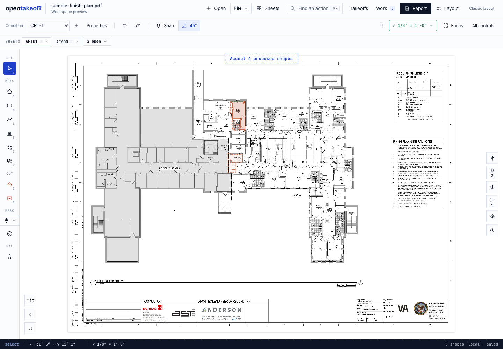
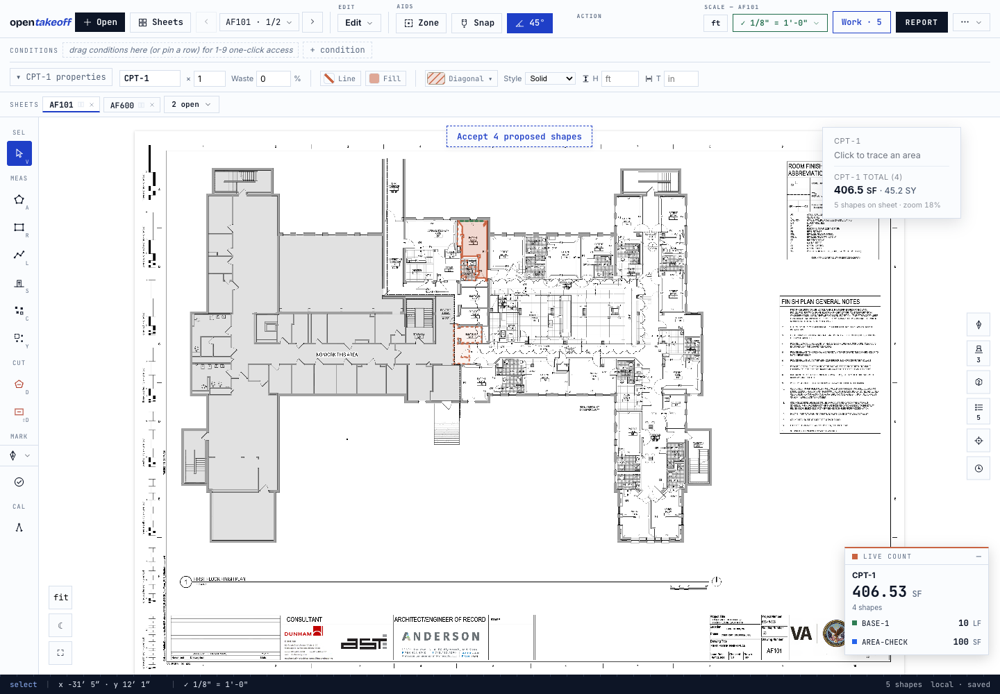
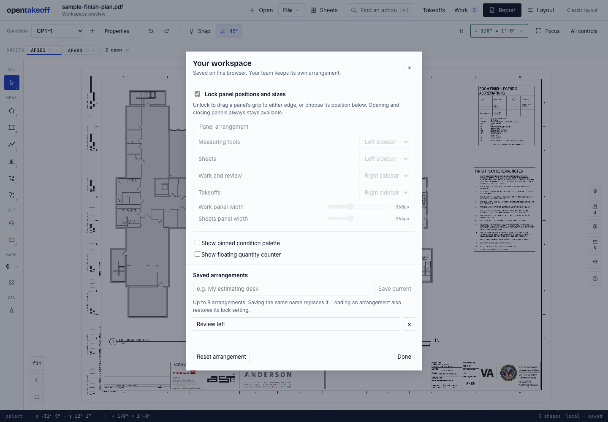
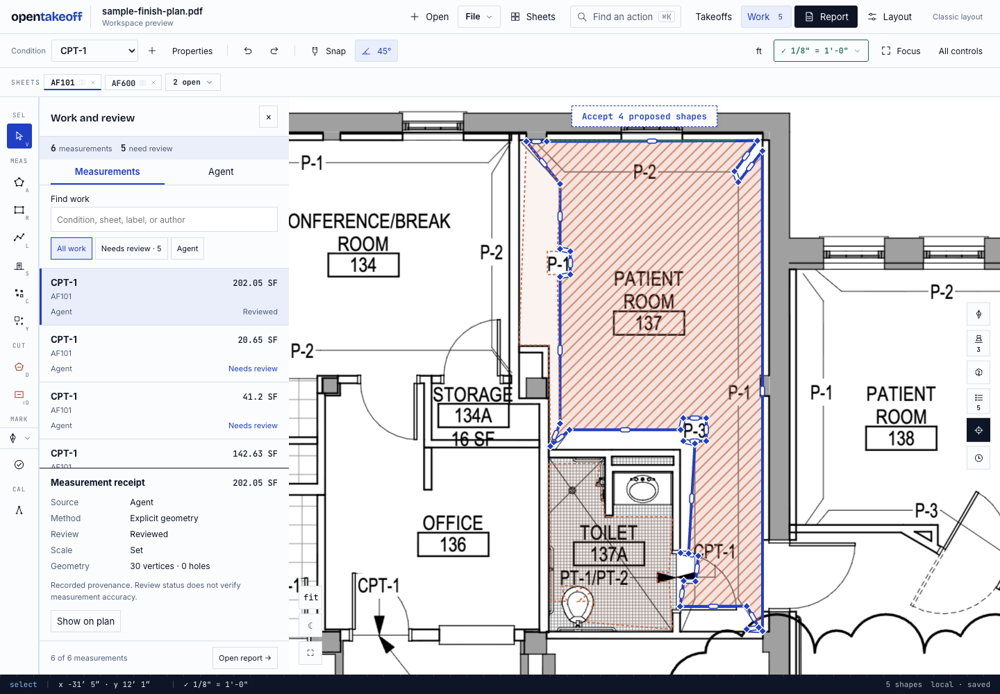
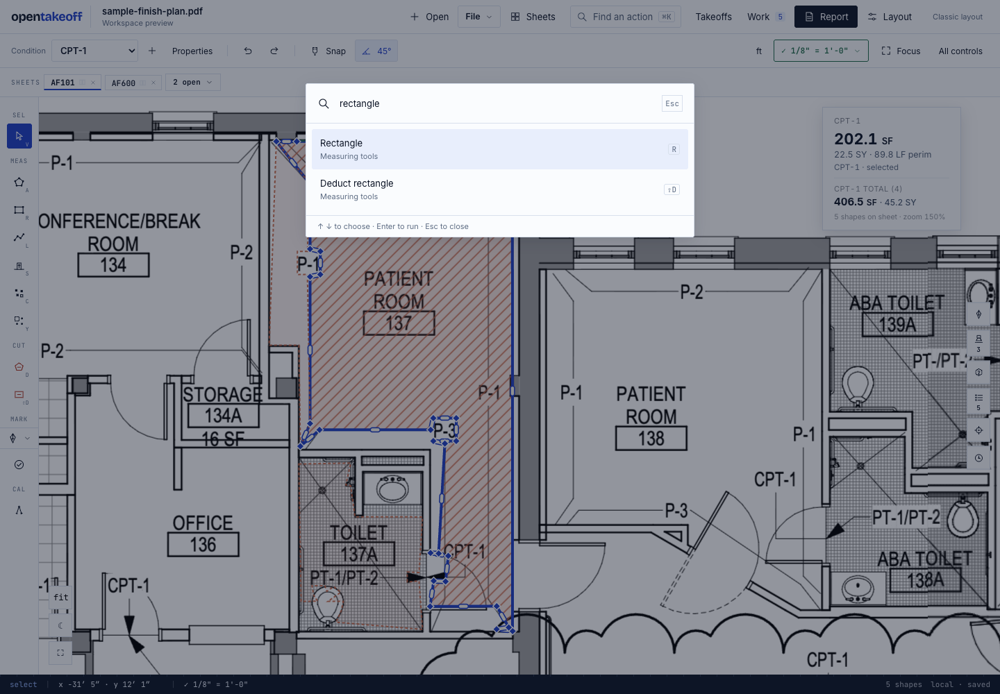
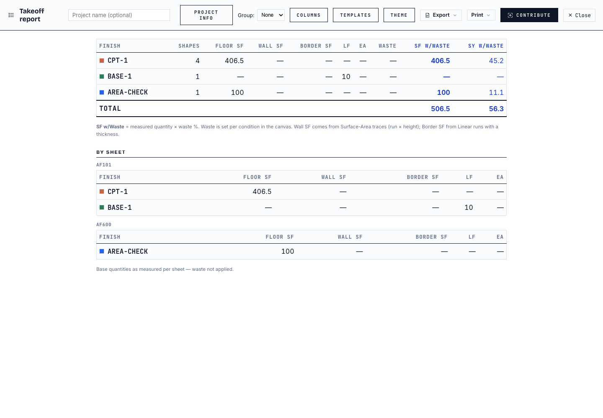
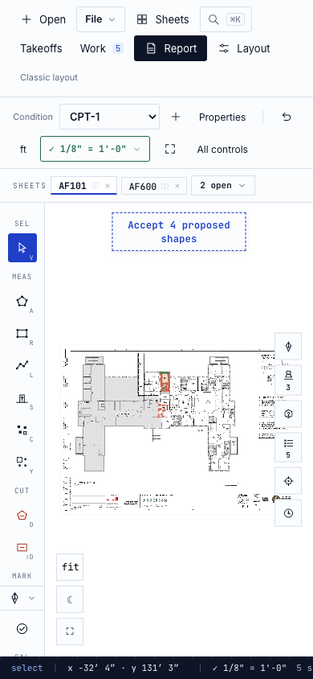

# Personal workspace: live verification

September 5, 2026. UI branch `feat/workspace-review-ui`, based on `7a3c8eb`.

## Automated check

Node **v24.18.0**, `cd web && npm run check`: typecheck, lint, **1,723 passing tests, zero failures or skips**, pinned benchmark unchanged, production build passed. Four new preference tests cover lock enforcement, invalid positions, corrupt/versioned storage, bounds, and round-trip isolation from project fields. Documentation link check passed.

The temporary link to locally available recognition models was used for the complete test gate and removed from the worktree afterward. No model assets or new plans were added to this change.

## Browser checks

Tests used a separate Chromium instance, the existing bundled two-page sample, and six measurements imported through the JSON importer from actual MCP output. The imported polygons exercise inspection and persistence; they do not establish detector accuracy or form a new demo dataset. One-Click and toolbar Command/Voice remain gated.

| Workflow | Observed result |
|---|---|
| Area, four clicks and Finish | **161.28 SF**, expected 161.28 SF; perimeter 52.8 LF |
| Rectangle, two corners | **161.28 SF**, expected 161.28 SF |
| Linear, two points and Finish | **16.8 LF**, expected 16.8 LF |
| Count | **1 EA**, expected 1 |
| Deduct Rectangle | **161.28 SF** with `measure_role: deduct`; expected deduction 161.28 SF |
| Undo drawing | Each temporary test shape removed; original six shapes remain |
| Agent review | First imported quantity remains 202.05 SF; Mark reviewed, Undo and Redo update its receipt |
| Cross-sheet work | Selecting the 100 SF measurement opens AF600 and its four-vertex boundary |
| Sheet search | Searching AF101 returns one sheet; selecting it opens AF101 |
| Report | CPT-1: **406.5 SF** (stored sum 406.53); BASE-1: **10 LF**; AREA-CHECK: **100 SF** |
| JSON export | All six original IDs, vertices, holes, quantities, roles, sheet IDs and condition IDs equal the MCP input; no personal layout fields |
| Classic/preview round trip | Stored shapes and scales equal before/after the layout-only sequence; reload restores opted-in preview |
| Drag placement | Sheets dragged from left to right using the pointer grip; keyboard Left returns it to the left |
| Lock | Position selectors disabled and grips absent; Takeoffs edge resizing unavailable while locked |
| Panel placement | Work at left x=56, width=360; Takeoffs at left x=0 with tools moved right to x=1384 in a 1440 px window |
| Saved arrangement | Save “Review left”, reset, then load restores Work on the left and the arrangement's lock state |
| Action search | Cmd+K, query “rectangle”, Enter arms the existing Rectangle tool; Escape closes the dialog |
| Focus | Existing Focus action hides chrome while leaving the measuring rail; F restores chrome |
| Runtime | No page runtime errors captured |

Drawing test points on the sample were normalized coordinates (0.07, 0.80) to (0.12, 0.84). With a 6048 × 4320 source and 1/18 ft per source pixel, the expected sides are 16.8 ft and 9.6 ft. This is a UI-to-engine regression test, not an assertion that those coordinates trace a real room. Stored results were read after the existing save debounce; immediate reads can otherwise observe the previous operation.

## Space and narrower windows

At 1440 × 1000, with the same two open sheet tabs, collapsed side panels, and the tested classic condition setup, the canvas row measured **832 px high in preview versus 803 px in classic**. This is 29 px of additional vertical room for that configuration. The larger change is control grouping and optional panels, not a claim of a dramatic canvas-area increase.

Bounds were checked at 1440, 1280, 1100, 1024, 800, 640 and 390 px. Scale and Work occupy separate rows and do not intersect. Document width stayed within the viewport. A later small-screen adjustment removed the brand from the crowded header; a final 390 × 844 capture shows the drawing and reachable toolbar controls. At 1024 × 768, the left Work drawer occupies x=56, width=360, and selecting work returns to the drawing.

These checks do **not** validate physical phone interactions, phone tile rendering, exhaustive combinations of simultaneously open legacy panels, configured cloud authentication, or performance on very large plan sets. Those systems were not changed. Arbitrary floating windows and bottom docking are not implemented. Saved arrangements retain placement/width/display preferences, not panel open/closed state.

## Real application captures

## Preview deployment

Preview: [workspace-lab](https://workspace-lab--opentakeoff.netlify.app/?workspace=calm). Deploy ID `6a9bb0d80fd94c4c0515b0ca`. Published with explicit `--dir web/dist --functions web/netlify/functions`, without a production flag. Live entry assets matched the local production build byte-for-byte:

| Asset | SHA-256 |
|---|---|
| `index-CNUxoMbO.js` | `827ce09edb47b23647b4dd4d3d405f8eb57f1326a14937a431c9707c937a61fe` |
| `index-TloYgzUV.css` | `48d88cf29741053702c52e4008c3b482c68268f581c24ca25459a1fb46ae4a95` |

No merge to main, production deploy, MCP change or tag push occurred.

## Reproduce

1. Start `cd web && npm run dev -- --port 5201`; open `http://localhost:5201/?workspace=calm` or use the preview link.
2. Load the existing sample plan, set/confirm its scale, choose Area on the sidebar, trace and Finish. Open Work and Report. Undo the test shape.
3. Open Layout, unlock, move a visible panel by its grip or position selector, save a named arrangement, reset and load it again. Lock and verify the handles disappear.
4. Switch to Classic layout and back through **⋯ → Workspace preview**, then reload. Export takeoff JSON and compare quantities and geometry.
5. Repeat at a narrower window, inspect Scale/Work bounds and panel close controls. Use Fit when changing viewport size; the existing renderer is unchanged.
