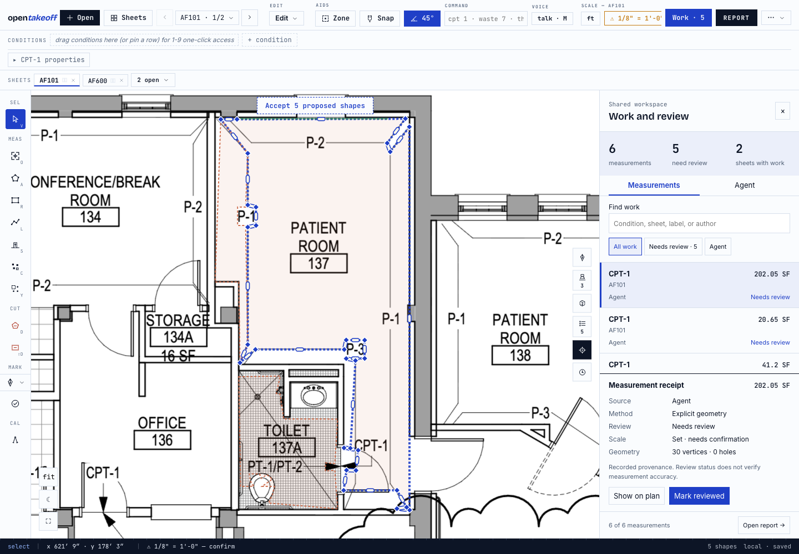
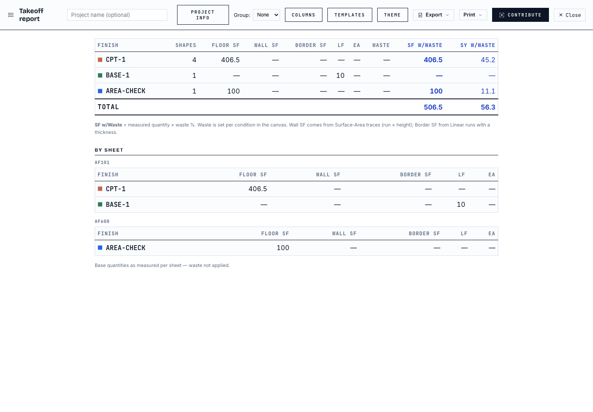
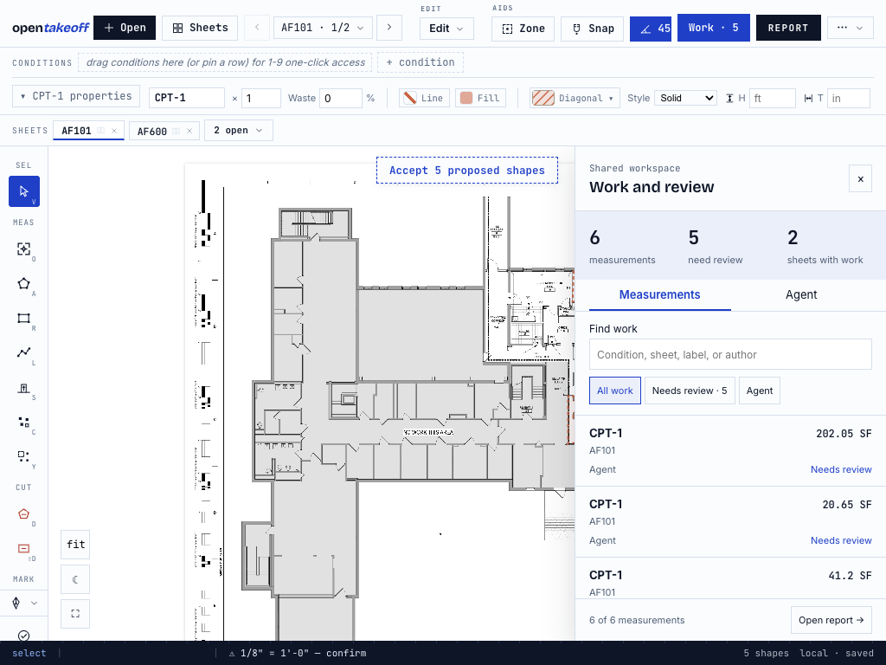
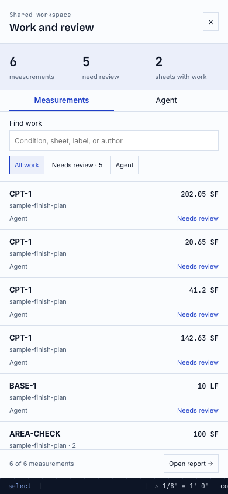
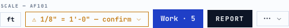

# Work and review: live verification

Verified September 5, 2026 against the UI branch based on `40f751d`.

## Executed checks

- Node **v24.18.0**: `cd web && npm run check` passed type checking, lint, **1,714 tests**, the pinned benchmark, and the production build. The final responsive CSS adjustment received a fresh production build. Documentation links passed `node scripts/check-doc-links.mjs`.
- Created six measurements through actual MCP `measure_polygon` and `measure_line` calls, then imported `export_takeoff` through the browser’s JSON importer. No room detector was called. Four polygon inputs came from the existing bundled-plan benchmark; a second-sheet 10 × 10 ft square tests cross-sheet navigation. These are UI verification fixtures, not a new demo or a claim of room-detection accuracy.
- All six imported shapes appeared as agent work needing review across two sheets. Their stored quantities matched the MCP results below.
- **Mark reviewed** changed one origin receipt without changing any other shape field, including geometry and computed quantities. Undo restored the exact original shape array.
- Selecting the second-sheet measurement opened that sheet and selected its boundary. Its review state survived reload.
- A rectangle drawn with the canvas appeared alongside imported work. **Agent** filtered six of seven measurements. Undo removed the temporary rectangle.
- Changing display units showed 202.05 SF as 18.77 m²; the stored quantity remained 202.05 SF.
- Search survived closing and reopening the panel. Arrow-key tab navigation worked. Imported measurements remained accessible with no model configured.
- At 1024 × 768, selecting a measurement closed the drawer and returned to its boundary. At 390 × 844, Work occupied the viewport above the status strip. Desktop verification used 1440 × 1000.
- The floating counter did not intercept review controls or appear over the report. No browser runtime errors were recorded.

| Fixture | MCP quantity | Work quantity |
|---|---:|---:|
| First polygon | 202.05 SF | 202.05 SF |
| Second polygon | 20.65 SF | 20.65 SF |
| Third polygon | 41.20 SF | 41.2 SF |
| Fourth polygon | 142.63 SF | 142.63 SF |
| Base line | 10 LF | 10 LF |
| Second-sheet square | 100 SF | 100 SF |

The existing report displays the four first-sheet polygons as **406.5 SF** (stored sum 406.53 SF), the second-sheet square as **100 SF**, and the line as **10 LF**. Report rounding is unchanged.

## Captures from the running app

## Reproduce

1. Run `cd web && npm run dev -- --port 5201` and load the existing sample plan.
2. Set a scale and draw a rectangle, or import a takeoff exported by MCP.
3. Choose **Work**. Search, filter, and select a measurement. Confirm the selected boundary belongs to the indicated sheet.
4. For pending work, choose **Mark reviewed**, then undo. Confirm its quantity and boundary stay unchanged.
5. Close and reopen Work. Open the report and confirm its controls are unobstructed. Repeat at desktop, tablet, and phone widths.

This pass did not test live multi-actor synchronization or a configured model run. Neither capability was added by this change.

## Toolbar regression repair

The scale trigger was inside the horizontal scrolling region and was clipped
where the pinned Work control began. Scale and units now share the pinned
controls with Work and Report. At widths of 800 px and below, that group moves
to its own wrapping row. Calibration handlers and measurement logic are unchanged.

Browser checks at widths 1440, 1280, 1024, 800, 640, and 390 px confirmed the full
unconfirmed scale trigger stayed inside the viewport and did not intersect Work.
This verifies toolbar layout, not phone canvas rendering or touch navigation.

After rebasing onto `b79410d` (the existing One-Click gate), Node 24 passed the complete web check again. The gate remains in place; this repair changes no engine files.
