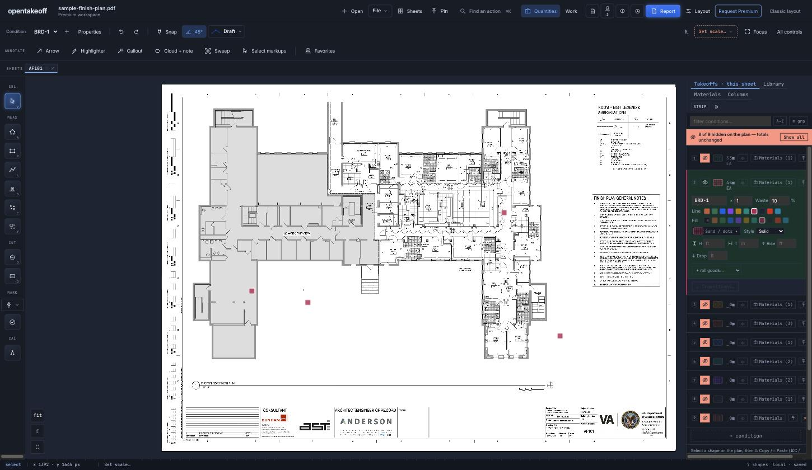

# Condition visibility review (#440)

An eye leads every row in the Takeoffs panel. Click hides or shows that condition's takeoffs on the plan, count marks included; **⌥-click** shows only that condition. Hidden work still counts everywhere a number is read.

## Verification

`cd web && npm run check` on Node 24.18.0: typecheck, lint, tests, benchmark and production build passed; `test/conditionVisibility.test.ts` adds 7 cases for the eye / isolate rules and `test/conditionEye.test.ts` 6 for the row eye, the hidden bar and the icons (markup plus the click contract: plain vs ⌥, no bubbling to the row).

Browser walkthrough on the bundled public `sample-finish-plan.pdf`, 3 count marks on CPT-1 and 3 on BRD-1:

| Step | Expected | Observed |
|---|---|---|
| Click CPT-1's eye | its marks leave the canvas, quantities unchanged | green marks gone, pink remain; both rows still 3 EA; status bar still 6 shapes; bar reads *1 of 9 hidden* |
| **Show all** | everything back | bar gone, all six marks drawn |
| ⌥-click BRD-1's eye, then again | isolate, then restore | 8 of 9 hidden with only BRD-1 pressed; second ⌥-click clears the bar |
| Place a count on BRD-1 while it is hidden | new work is never born invisible | BRD-1 revealed (8 → 7 hidden), mark drawn |
| Select tool, click where a hidden mark sits | nothing picked | no selection; clicking a visible CPT-1 mark selects it |
| Hide every condition, open the Report | hidden work still counted | CPT-1 3 EA, BRD-1 4 EA |

Not exercised by hand: the marked-set PDF and JSON/DXF exports with conditions hidden. They read the full shape list (`shapes`), which this change does not touch.
