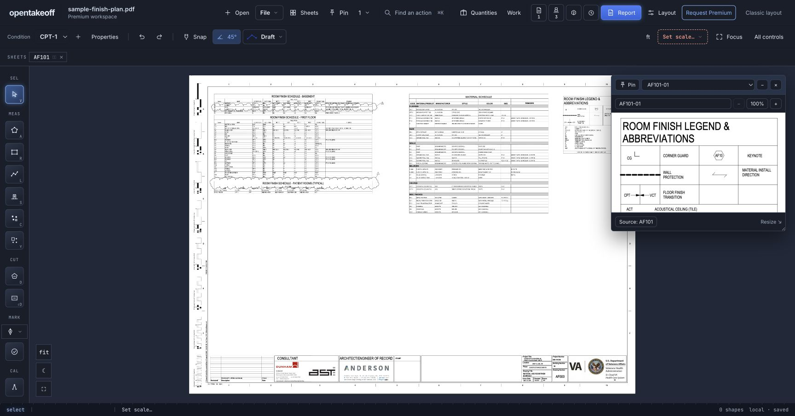

# Pin toolbar review

Click **Pin** beside **Sheets**, then click two corners of any drawing region. A floating reference stays visible while the takeoff moves to another sheet. The window supports independent zoom, movement, resizing, collapse, naming, closing/reopening, and return to source. The crop is saved with the project. Existing image-placement tools remain available.

Built on Kevin N. Murphy’s [image capture contribution](https://github.com/Kentucky-ai/opentakeoff/pull/346).

## Verification

`cd web && npm run check` on Node 24.18.0: typecheck, lint, 1,799 passed / 3 skipped / 0 failed, benchmark passed, production build passed.

Browser walkthrough used the bundled public `sample-finish-plan.pdf`, not a private bid. Reproduce:

1. Open the bundled sample. In Spline, put that sample in an isolated test project.
2. Click Pin and box a note or legend on AF101. Expect a reference window and a count beside Pin; observed both.
3. Switch the underlying drawing to AF600. Expect the AF101 crop to remain visible and readable; observed both.
4. Zoom the pin. Expect its zoom to change independently; observed 100% → 125% while the active drawing stayed on the same sheet.
5. Reload. Expect the saved crop to remain available; observed in both apps.
6. Source returns to AF101. Spline additionally checked rename, move, and source navigation through the actual UI.

Export regression: a project containing only a pin must not produce a marked sheet. The added automated test checks this; existing image-export tests continue to pass.

## Limits

The saved reference is a raster snapshot, capped at 1600 pixels on its longest side by the existing capture pipeline. It does not update when the original PDF changes. A single reference window shows one saved pin at a time through its picker. Window position and zoom are session state; crops and names are project data. This verification does not claim OCR, a full split-sheet viewer, or mobile-specific drag testing.
