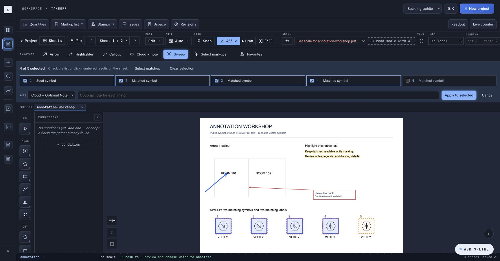
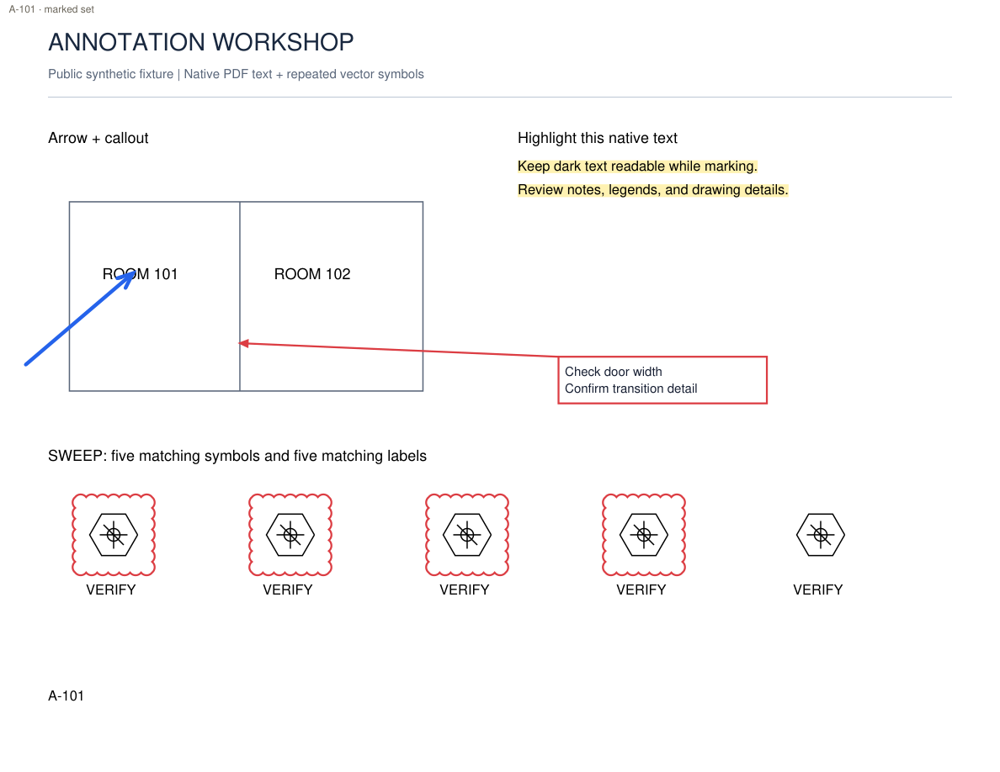
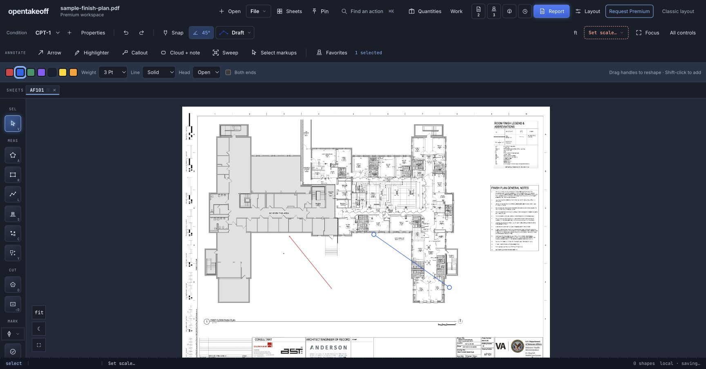
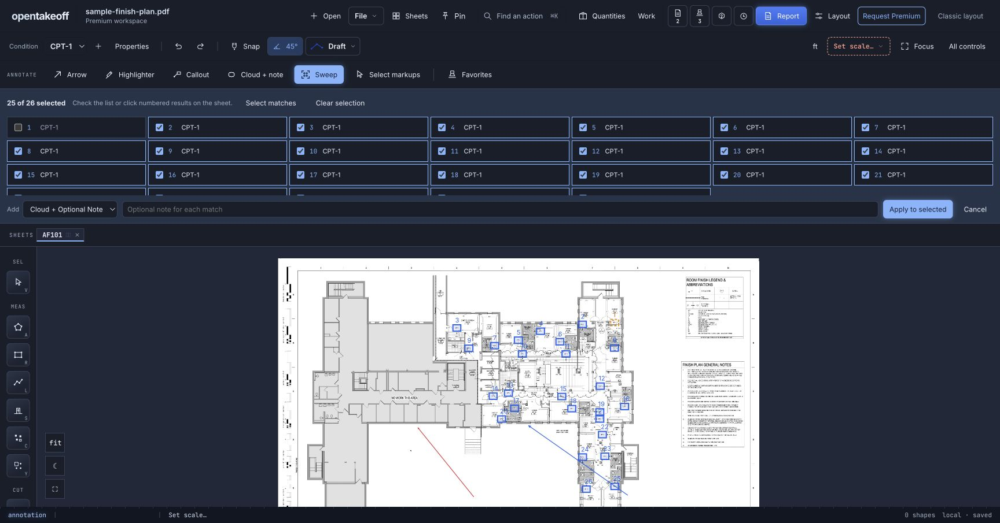

# Annotation toolbar review

All images use a self-authored synthetic fixture, with no customer plans or prices.

The shared review component in Spline found 5/5 repeated symbols. Unchecking result 5 left 4 selected and changed its sheet preview to a dashed excluded box. Applying four results added four clouds; one undo removed all four and redo restored them. Cancellation added nothing. The fixture contained no takeoff shapes throughout. Native-text highlighting selected two runs; black source text remained legible. The callout text handle moved while the target stayed fixed. A named blue arrow favorite survived page reload.

The exported fixture shows the four included clouds, excluded fifth symbol, two highlighted text runs, multiline callout, and editable blue arrow. PDF tests check retained black pixels under highlight at 0/90/180/270 degrees in Spline; OpenTakeoff tests exercise pdf-lib vector exports at 0/90 degrees. Both scenes share page-relative geometry. This is targeted evidence, not a claim of matching every vendor behavior or every PDF font.

Reproduce: open [the synthetic PDF](annotation-workshop.pdf), use Sweep → Drawn symbols, box the first symbol, exclude the fifth checklist row, and apply. Undo/redo the batch. Use Highlighter → Text on the two body lines and export a marked set. Tests are in `annotationTools` and the PDF export suites.

Commands: `npm run check --prefix web`; `npm run check --prefix protocol`; `npm run check:tool-count --prefix mcp`; `npm run check:wiki --prefix mcp`; `node scripts/check-doc-links.mjs`.

OpenTakeoff: the saved arrow reloaded; a blue open-head 3 pt arrow was created with a drag using the new toolbar.

Fragmented CAD-label regression: `CPT`, `-`, `1` join into `CPT-1`; a unit test excludes `VCT-1` and isolated `1` runs. In the OpenTakeoff bundled plan, text Sweep returned 26 complete `CPT-1` labels. Excluding one and applying added 25 clouds (markup count 2 → 27); one undo returned to 2.

