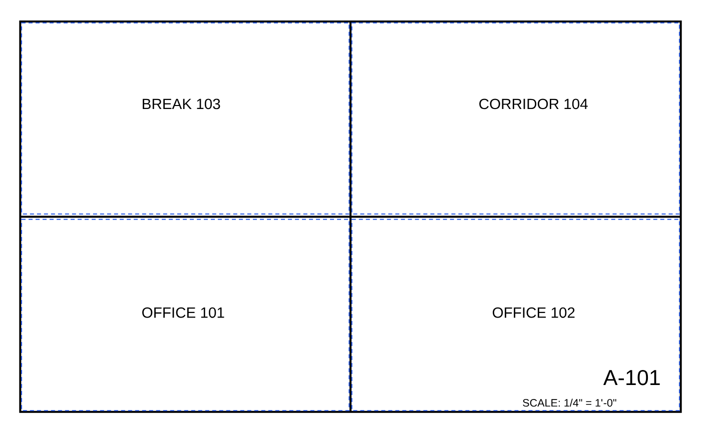
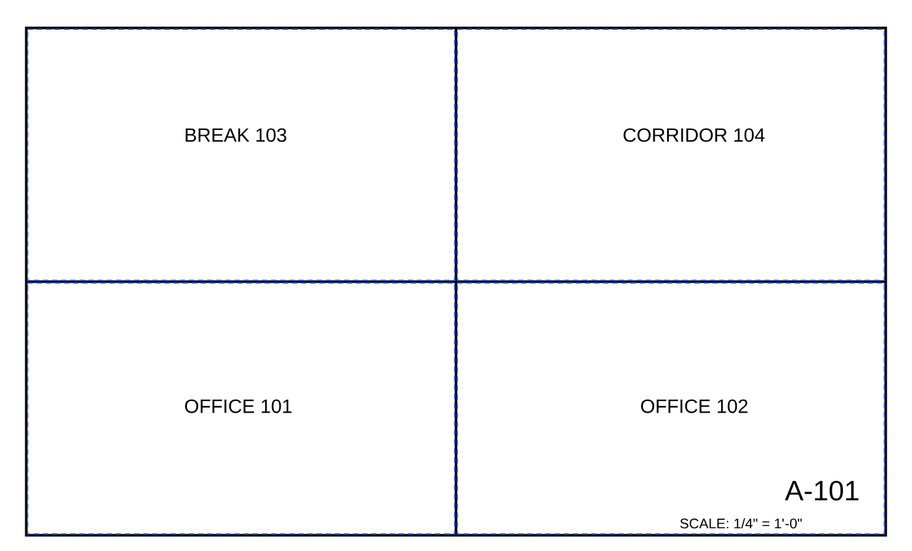

# Recorded public agent pilot

One `gpt-5.6-luna` agent (medium reasoning) drove the built OpenTakeoff MCP
0.9.83 server in default flat mode on the public synthetic sample plan. The
first task was to measure all four named rooms to the inside face of the drawn
wall strokes, use the printed scale and user-specified finish F-1, retain room
labels, inspect the overlay, and export without human approval.

The agent received public tool schemas and wiki resources through a local
stdio relay. The analytic answer key was not supplied; the agent was instructed
not to read the generator, scorer or reference files. This public fixture was
not isolated as held-out data. This is one recorded pilot, not a model comparison
or evidence of accuracy on real construction plans.

## Observed result

| Measure | First pass, frozen before feedback | Assisted correction |
|---|---|---|
| Tool calls | 21 | 12 additional |
| Discovery/resource requests | 16 | 1 additional |
| Error replies | 1: no finish schedule found | 0 |
| Reported floor area | 1,704 SF | 1,725.56 SF |
| Analytic geometric area | 1,725.5432098765432 SF | Same reference |
| Strict scorer result | Fail: missing labels | Pass: IoU 1.0 and boundary distance 0 px in all rooms |
| Durable room labels | 0 of 4 | 4 of 4 |
| Human approval created | 0 | 0 |
| Shapes pending human review | 4 of 4 | 4 of 4 |

The first trace used arbitrary offsets from stroke centerlines. On this fixture,
`get_sheet_vectors` returned `meta = 96`: its documented high nibble encodes a
6-pixel device pen width. The analytic wall-face boundary is 3 pixels inside the
centerline. That fact is specific to this single-stroke synthetic construction;
real walls can use multiple lines and different finish-face semantics.

The first pass was frozen at request 37. The reviewer then disclosed that the
wall-face alignment and exported labels were wrong, directed the agent to the
public pen-width metadata, and asked it to persist labels with `edit_shape`.
No reference coordinates were provided. Requests 41–44 corrected and labeled
all four shapes. This is explicitly **assisted correction**, not an independent
second trial. Each corrected room reports 431.39 SF; summing rounded room values
explains the small difference from the analytic total.

The [first-pass export](first-pass.takeoff.json) and
[assisted export](assisted.takeoff.json) are preserved separately. Their strict score records are [first pass](first-pass.score.json)
and [assisted](assisted.score.json). The
[pilot record](pilot.json) pins source/server identifiers, counts and export
hashes. The [abridged call ledger](calls.abridged.json) retains each request and
text/structured tool result; image bytes and repeated discovery schemas are
omitted and local paths are replaced by `<SOURCE>`/`<OUTPUT>`. It is not a full
model conversation or token-usage record. The relay re-requested `tools/list`
when the agent requested a filtered schema, so discovery counts describe this
interface and must not be presented as a native-client efficiency comparison.

## Visual review

First pass:



After assisted correction:



The parent reviewer also opened both pages of the corrected marked-set PDF.
The quantity tags overlap parts of the source room labels in this existing
export layout; this pilot does not claim to fix label placement or rendering.

## Re-score the frozen predictions

From the repository root, after installing MCP dependencies:

```sh
# Expected nonzero: missing labels prevent strict room matching.
node evals/mcp-workflow-bench/score.mjs evals/mcp-workflow-bench/evidence/first-pass.takeoff.json
# Expected zero: corrected labeled wall-face geometry.
node evals/mcp-workflow-bench/score.mjs evals/mcp-workflow-bench/evidence/assisted.takeoff.json
```

See the [benchmark contract](../README.md) for the analytic reference and
scripted workflow. These results leave [#409](https://github.com/Kentucky-ai/opentakeoff/issues/409)
open. The next accuracy work needs more representative plans and frozen
predictions scored against independently reviewed boundaries.
